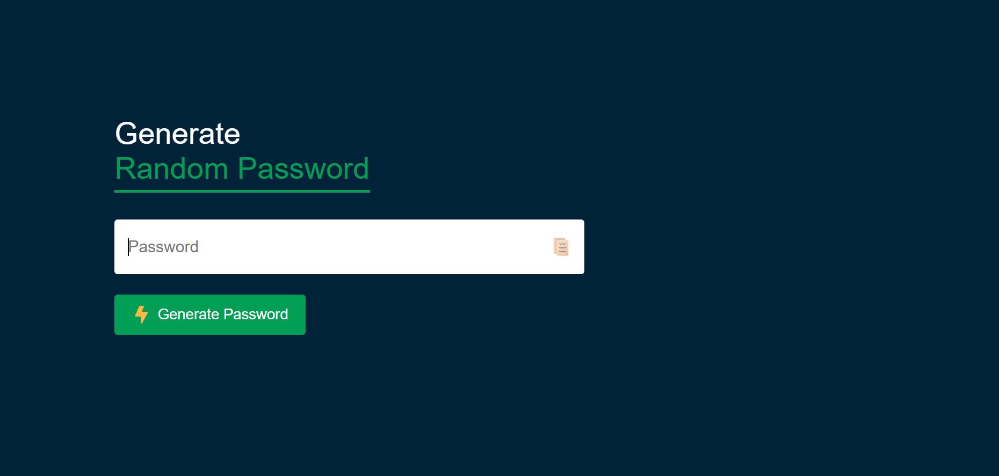

# 🔐 Random Password Generator

A simple and responsive **Random Password Generator** built using **HTML, CSS, and JavaScript**. It generates strong passwords containing uppercase letters, lowercase letters, numbers, and special characters. Users can also copy the generated password to the clipboard with a single click.

---

## 🚀 Live Demo

🔗 **Live Website:**  
https://random-password-generator-indol-eight.vercel.app/

---

## 📸 Screenshot



---

## ✨ Features

- 🔑 Generates a random 12-character password
- 🔠 Includes uppercase letters
- 🔡 Includes lowercase letters
- 🔢 Includes numbers
- 🔣 Includes special symbols
- 📋 One-click copy to clipboard
- 💻 Clean and responsive UI
- ⚡ Fast and lightweight

---

## 🛠️ Technologies Used

- HTML5
- CSS3
- JavaScript (ES6)

---

## 📂 Project Structure

```text
Random-Password-Generator/
│
├── index.html
├── style.css
├── script.js
├── README.md
│
└── images/
    ├── copy.png
    ├── lightning.png
    └── screenshot.png
```

---

## ⚙️ How It Works

1. Click the **Generate Password** button.
2. A secure 12-character password is generated.
3. Click the **Copy** icon.
4. The password is copied to your clipboard.
5. Paste it wherever you need.

---

## 📋 Password Rules

Each generated password contains at least:

- ✅ One uppercase letter
- ✅ One lowercase letter
- ✅ One number
- ✅ One special character

The remaining characters are selected randomly from all available character sets.

---

## 🔮 Future Improvements

- Password length customization
- Password strength indicator
- Include/Exclude symbols option
- Include/Exclude numbers option
- Dark/Light mode
- Password history
- Auto regeneration

---

## 👨‍💻 Author

**Bhaskar Yogi**

Aspiring MERN Stack Developer

- 🐙 GitHub: https://github.com/bs-bhaskar/random-password-generator.git

---

## ⭐ Support

If you found this project helpful, consider giving it a ⭐ on GitHub.

Happy Coding! 🚀